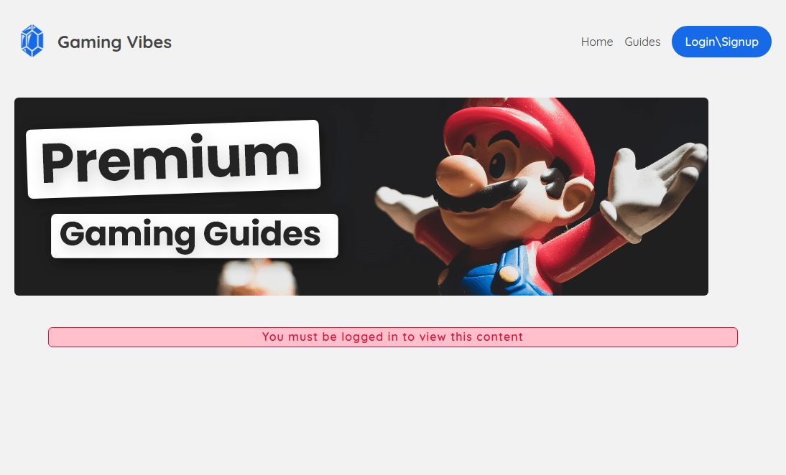

# Gaming Vibes

a website with nextjs netlify-identity-widget

you can visit this website on [https://gamingvibes-v.netlify.app]




## Image Credit (for use in project)

Rupee icon - [https://game-icons.net/1x1/delapouite/rupee.html](https://game-icons.net/1x1/delapouite/rupee.html)

Mario background - [https://unsplash.com/photos/_R95VMWyn7A](https://unsplash.com/photos/_R95VMWyn7A)
First, run the development server:

```bash
npm run dev
# or
yarn dev
```

Open [http://localhost:3000](http://localhost:3000) with your browser to see the result.

You can start editing the page by modifying `pages/index.tsx`. The page auto-updates as you edit the file.

[API routes](https://nextjs.org/docs/api-routes/introduction) can be accessed on [http://localhost:3000/api/hello](http://localhost:3000/api/hello). This endpoint can be edited in `pages/api/hello.ts`.

The `pages/api` directory is mapped to `/api/*`. Files in this directory are treated as [API routes](https://nextjs.org/docs/api-routes/introduction) instead of React pages.
